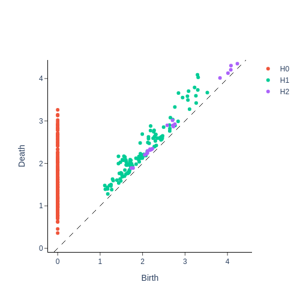
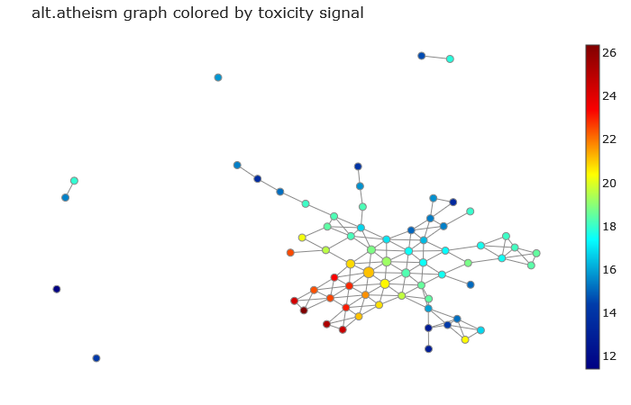
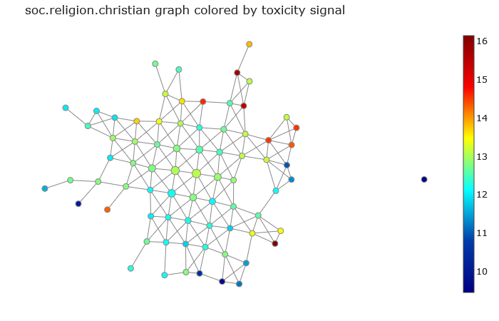
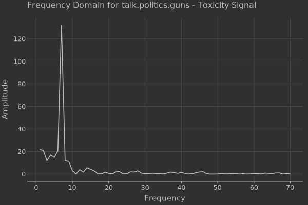

# Topological Analysis of Language Semantic Spaces

The idea behind this project is to analyse the differences between the semantic spaces of languages, where the semantic space is captured by the latent space of an encoding model.

To analyse the differences between spaces we perform an in depth topological analysis of the space structure, in particular:

- Persistence Analysis of simplicial complex built from the words embeddings.
- Graph Analysis of the graph resulting from the Mapper Algorithm.

[](https://colab.research.google.com/drive/1FZm0MuFNjk7VHZ332eF6xKYytbuIXjC-?usp=sharing)

## Dataset

For our analysis we're going to use the `fetch_20newsgroups` dataset available on scikit-learn ([link](https://scikit-learn.org/stable/datasets/real_world.html#newsgroups-dataset) to the documentation). In particular we focus on 3 of the 20 topics:

- alt.atheism
- soc.religion.christian
- talk.politics.guns

Each specific topic defines a "language" to which a user can adhere.

## Cleaning and Preprocessing

For each document in the dataset we have removed the headers, the footer and the quotes, keeping only the main text which is then parsed using a personalized [SpaCy](https://spacy.io/) Tokenizer, that:

- Keeps only the lemma of a word.
- Keeps only nouns, adjectives, verbs and pronouns.
- Merges entities in one token.
- Changes negated verbs in "not_[lemma of verb]".

Each document now is seen as a special bag-of-words.

|Language|Number of tokens|
|:--|--:|
|alt.atheism|5747|
|soc.religion.christian|7599|
|talk.politics.guns|6676|

Because the topological analysis we're going to perform are computationally expensive we would like to reduce the number of tokens keeping only the most important ones.


> The complementary ECDF of the word document frequency (left) and of the word frequency in the language (right).

From the complementary ECDF plots we can notice that the majority of the tokens appear few times both in the entire corpus and both in the documents, while there is only a small portion of them that have both high frequencies. This consideration leds to the following assumption:

**Assumption**: tokens that have a large frequency are characteristic of a language and retain the major informations about its structure.

The assumption considers stop words also characteristical terms of a language (because they usually have high frequency), but thanks to the previous tokenization step stop words are automatically removed.

So the analysis consider only tokens that appear at least 10 times in the overall corpus and in 15 different documents.

|Languages|Number of tokens|
|:--|--:|
|alt.atheism|305|
|soc.religion.christian|546|
|talk.politics.guns|460|

Each language has its own istance of the model, which is trained on the respective bag-of-words documents.

The models encodes the tokens in vectors of size 100 that are then processed with a Robust PCA which keeps only the 5 most informative components of the embeddings.

|Languages|Number of tokens|Embeddings dimension|
|:--|--:|--:|
|alt.atheism|305|5|
|soc.religion.christian|546|5|
|talk.politics.guns|460|5|

## Topological Data Analysis (TDA)

### Persistent Homology with Vietoris-Rips Complexes

In this section we analyse the persistent homology of each semantic space by fitting a Vietoris-Rips filtration on the embeddings of each language.

#### All languages

In the `README.md` to summurize only one of the analysed cases is reported: all three languages with their respective complete vocabulary.

<p float="left">
  
   
  
</p>

> Peristence Diagram plot. To the left the alt.atheism language, to the center the soc.religion.christian and to the right the talk.politics.guns one.

|Language|Amplitude|Number of points|Persistence Entropy|
|:--|--:|--:|--:|
|alt.atheism|[321.963775, 25.284133, 3.604191]|   [290, 120, 21] |[8.079624, 6.679756, 4.318987]|
|soc.religion.christian| [594.221897, 60.268605, 10.546292] |   [530, 255, 67] |[8.970789, 7.80292, 5.97405]|
|talk.politics.guns| [511.121085, 51.901615, 10.241335] |[441, 224, 59]|[8.708129, 7.619802, 5.76943]|

From the above results (and the others shown in the notebooks) we can assess:
- The 'christian' language appears to be topologically similar to the 'guns' language but different from the 'atheism' language.
- The 'atheism' language seems to be smaller but, more importantly, more cohesive (there is less presence of gaps for each dimension) compared to the other languages.

### Mapper Algorithm and Signal Analysis

#### Toxicity Signal


> The boxplot of the word/entity toxicity score for each language.

In this study, our objective is to evaluate whether the graph topologies of different languages capture some of the structural aspects of the toxicity signal.

Each document is scored from 0 to 100 by the Google [Perspective API](https://perspectiveapi.com/), which calculates how much a document is toxic. Then the score is propragated to every single words $w_i$ as:

$$
\begin{gather}
S(w_i) = \frac{1}{|D_i|}\sum_{d\in D_i} S(d)\\
\text{where }D_i\text{ is the set of documents in which }w_i\text{ appears.}
\end{gather}
$$

By plotting the signal over the graph defined by the Mapper Algorithm we can notice that it seems to be captured by the topology of the semantic space:

<p float="left">
  
   
  
</p>

> Graphs of the semantic spaces colored by the toxicity signal. At the left the atheism language, center the christian's one and at the right the talks about guns.

This result is more evident by performing a spectral analysis of the graph signals in which we can notice a frequency profile mainly determined by low frequencies.

<p float="left">
  
   
  
</p>

> Spectral analysis of the toxicity signal over the graph built from the projection of the inverted index on the words dimension.

<p float="left">
  
   
  
</p>

> Spectral analysis of the toxicity signal over the Mapper Algorithm graph.

<p float="left">
  
   
  
</p>

> Spectral analysis over the toxicity graph signal over the Mapper Algorithm disaggregated.

## Relative Semantic Representation 

In this section we're going to analyse the differences between these languages by mapping their semantic space in a common relative representation.

The relative representation is built upon the comparison of word and anchor embeddings, where anchors are chosen words that are expected to convey the same semantic meaning across languages.

We chose to employ commonly shared adjectives across these three languages as anchors for the relative semantic representation.

**Why adjectives?**: Summarizing, adjectives play a pivotal role in defining the quality and semantic of nouns by providing detailed descriptions of their attributes. They introduce properties that nouns alone cannot express, allowing for finer gradations of meaning. Semantically, adjectives denote qualities or properties, while syntactically, they modify nouns, enhancing the expressiveness of language. This combination of semantic and syntactic roles enables adjectives to specify the characteristics of nouns, making language more informative and precise. Adjectives are essential for distinguishing between different entities based on their qualities, contributing significantly to the richness and nuance of language. [[1](https://semantics.uchicago.edu/kennedy/docs/routledge.pdf), [2](https://web.ics.purdue.edu/~vraskin/adjective.pdf), [3](https://academicmarker.com/grammar-practice/words/word-types/adjectives/what-are-adjectives-and-how-do-they-function/)]

<p float="left">
  
   
  
</p>

> The relative representation using as axis two of the anchors ('good' and 'bad').

Now we can plot the density distribution of the pairwise $l_2$-distance of the relative semantic representation of the same token for each couple of languages:


The plot above illustrates that the language 'alt.atheism' exhibits distinct semantics compared to the other two languages, whereas 'soc.religion.christian' and 'talk.politics.guns' appear to have more closely aligned semantics.

## Directory Structure

```bash
./root
  |_ img/
  |_ notebook.ipynb
  |_ README.md
```

## Team

- [Mario Edoardo Pandolfo](https://github.com/JRhin)

## Used Technologies

   
